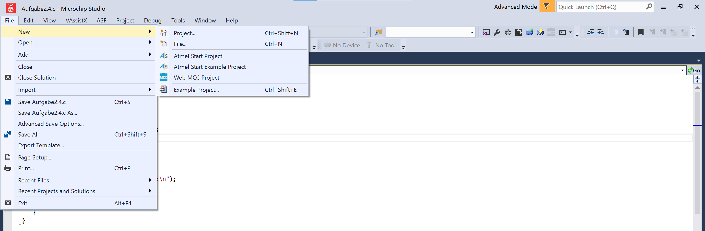
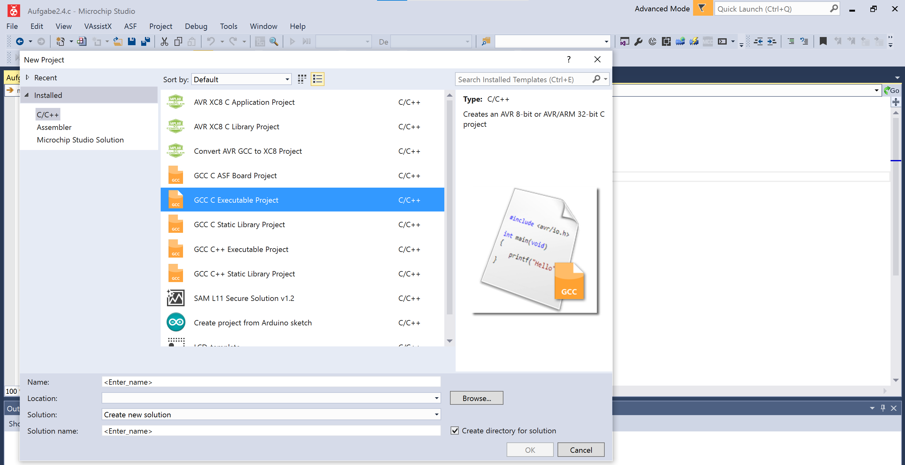
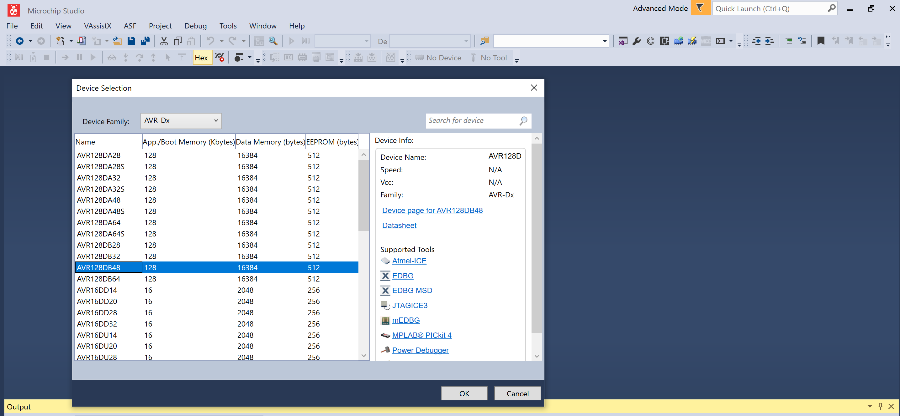
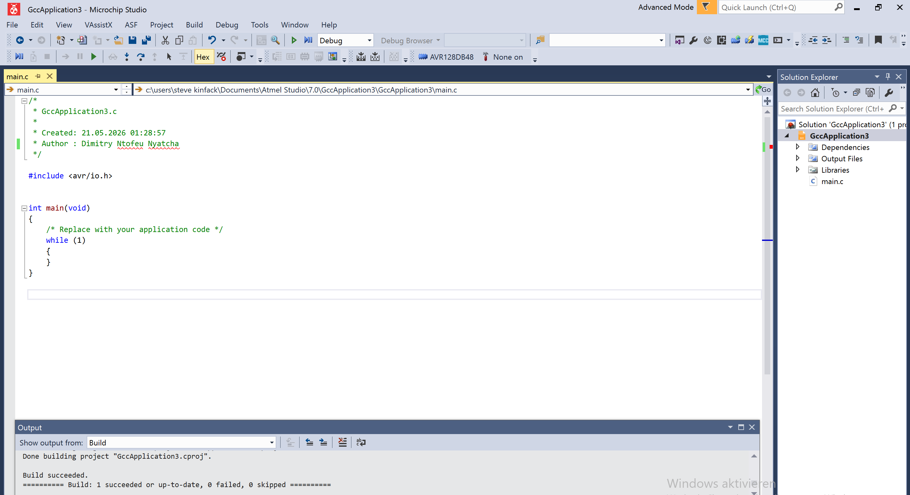
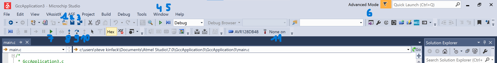

# Microchip Studio - Setup Guide

This guide covers everything you need to get started with Microchip Studio
for the AVR128DB48 exercises (Übung 03 onwards).

Download: [Microchip Studio](https://www.microchip.com/en-us/tools-resources/develop/microchip-studio)

---

## Creating a New Project

Use `Ctrl+Shift+N` or navigate through the menu:

**File -> New -> Project...**

---

### Project Type Selection

In the New Project dialog:

1. Expand the **Installed** menu in the left panel
2. Select **C/C++**
3. Select **GCC C Executable Project**
4. Enter a name for your project
5. Choose a save location
6. Confirm with **OK**

---

### Device Selection

After confirming, a Device Selection dialog opens:

1. Set the Device Family dropdown to **AVR-Dx**
2. Select **AVR128DB48** from the list
3. Confirm with **OK**

Your project is now ready with a `main.c` file already open.

---

## IDE Navigation

Once your project is open, the following areas of the interface are available:

| # | Element | Description |
|---|---------|-------------|
| 1 | Code Editor | Main area for writing and editing code. Breakpoints can be set in the left margin. |
| 2 | Build (`Ctrl+Shift+B`) | Compiles the project and reports errors or warnings. |
| 3 | Start Debugging (`F5`) | Uploads and runs the program on the connected board. |
| 4 | Build toolbar | Quick access to Build and Clean. |
| 5 | Debug toolbar | Step Into, Step Over, Step Out, Continue, Pause. |
| 6 | Quick Launch | Search for any IDE function by name. |
| 7 | Step Into (`F11`) | Enters a function call during debugging. |
| 8 | Step Over (`F10`) | Executes the next line without entering functions. |
| 9 | Continue (`F5`) | Resumes execution until the next breakpoint. |
| 10 | Step Out (`Shift+F11`) | Exits the current function and returns to the caller. |
| 11 | Target device | Shows the currently selected device (AVR128DB48). |

### Useful shortcuts

| Action | Shortcut |
|--------|----------|
| Build | `Ctrl+Shift+B` |
| Save all | `Ctrl+Shift+S` |
| New project | `Ctrl+Shift+N` |
| Start / continue debug | `F5` |
| Step over | `F10` |
| Step into | `F11` |
| Step out | `Shift+F11` |
| Toggle breakpoint | `F9` |

---

## Typical Workflow

1. Open or create a project
2. Write your code in `main.c`
3. Build with `Ctrl+Shift+B`: check the Output panel for errors
4. Connect the AVR128DB48 board via USB
5. Start debugging with `F5`: the program uploads and starts running
6. Use breakpoints and the debug toolbar to inspect program state

---

*This setup applies to all exercises from Übung 03 onwards.*