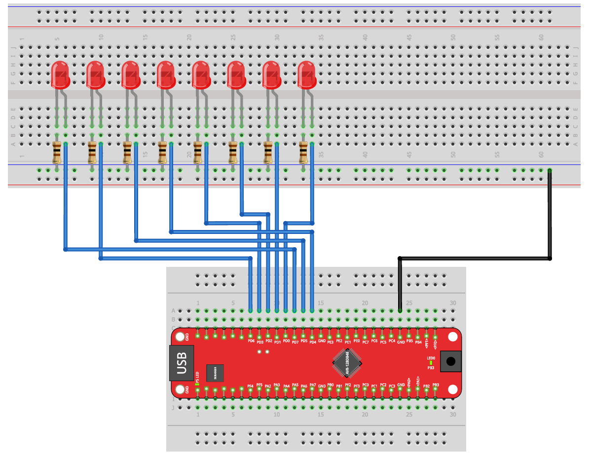

# Exercise 03: LED Control

Introduction to GPIO output on the AVR128DB48.  
This exercise covers turning on, blinking, and sequencing LEDs connected to Port D.

> New to Microchip Studio? See the [setup guide](https://github.com/gienyne/Some-Embedded-avr128db48-projekt/blob/master/docs/microchip-studio-setup.md) first.

---

## Hardware Setup

8 LEDs with series resistors connected to pins PD0 through PD7.  
The cathode of each LED connects to GND through a resistor.



| AVR128DB48 Pin | Component |
|----------------|-----------|
| PD0 – PD7 | LED 0–7 (anode) via series resistor |
| GND | Common ground rail |

---

## How to Use the Shared Files

The `../shared/` folder contains two files:

```
shared/
├── leds.h    - pin masks, constants, and function prototypes
└── leds.c    - reference implementation (solutions)
```

**Your workflow:**

1. Copy `leds.h` into your Microchip Studio project. It gives you all the `#define` constants and function prototypes you need.
2. Create your own `leds.c` alongside your `main.c` and implement the functions declared in `leds.h` yourself.
3. Include both files in your project. Your `main.c` only calls the functions - the implementation is yours to write.
4. Once you have solved a part, you can compare your implementation with the reference in `../shared/leds.c`.

> The goal is to write the function implementations yourself. Copying `leds.c` directly defeats the purpose of the exercise.

---

## Learning Goals

- Configure GPIO pins as output using `PORTD.DIRSET`
- Set, clear, and toggle pin states using `OUTSET`, `OUTCLR`, `OUTTGL`
- Implement software delays using busy-wait loops
- Use bit masks and bit shift operations to control individual or multiple pins
- Understand how binary values map directly to LED patterns

---

## Concepts Used in This Exercise

<details>
<summary>GPIO Direction Registers</summary>

AVR GPIO pins are controlled through hardware registers.  
Before writing to a pin, it must be configured as an output.

```c
PORTD.DIRSET = PIN7_bm;   /* set PD7 as output -> leaves other pins unchanged */
PORTD.DIRCLR = PIN7_bm;   /* set PD7 as input  -> leaves other pins unchanged */
PORTD.DIR    = 0xFF;       /* set all Port D pins as outputs at once           */
```

- `DIRSET` -> sets selected pins as outputs (1 = output)
- `DIRCLR` -> sets selected pins as inputs  (0 = input)
- `DIR`    -> overwrites the entire direction register

</details>

<details>
<summary>GPIO Output Registers</summary>

Once a pin is configured as output, its state is controlled with:

```c
PORTD.OUTSET = PIN7_bm;   /* drive PD7 HIGH: LED on  */
PORTD.OUTCLR = PIN7_bm;   /* drive PD7 LOW: LED off */
PORTD.OUTTGL = PIN7_bm;   /* toggle PD7 state         */
PORTD.OUT    = 0b00000101; /* write all 8 pins at once */
```

- `OUTSET` — drives selected pins HIGH without affecting others
- `OUTCLR` — drives selected pins LOW  without affecting others
- `OUTTGL` — flips selected pins in a single instruction
- `OUT`    — overwrites all output bits simultaneously

Writing a value directly to `OUT` is useful for patterns like the binary counter.  
Each bit maps to one pin: bit 0 -> PD0, bit 7 -> PD7.

</details>

<details>
<summary>Bitmasks and PIN_bm</summary>

A bitmask is a value where only specific bits are set.  
AVR headers define one mask per pin: `PIN0_bm` through `PIN7_bm`.

```c
PIN0_bm = 0b00000001   /* bit 0 */
PIN7_bm = 0b10000000   /* bit 7 */
```

Combining masks with `|` lets you control multiple pins at once:

```c
PORTD.OUTSET = PIN6_bm | PIN7_bm;   /* set PD6 and PD7 HIGH */
```

</details>

<details>
<summary>Busy-Wait Delays</summary>

The simplest way to create a delay is to loop doing nothing:

```c
for (volatile unsigned long i = 0; i < 100000; i++) {}
```

The `volatile` keyword tells the compiler this loop must not be optimised away.  
Without it, the compiler may detect that the loop has no visible side effect and remove it entirely.

This approach is called a busy-wait. The CPU is occupied during the entire delay  
and cannot do anything else. For simple LED exercises this is acceptable.

</details>

---

## Exercises

The exercise parts are described in [EXERCISES.md](https://github.com/gienyne/Some-Embedded-avr128db48-projekt/blob/master/exercices/03_led-control%20%26%2004_buttons/03-led-control/exercise/README.md).  
Work through them in order. Check `../shared/leds.c` only after solving each part yourself.

---

## Project Structure

```
03-led-control/
│
├── README.md
├── EXERCISES.md
├── images/
│   └── Versuchsaufbau1.png
│
├── starter/
│   ├── 3.1-light-up/main.c
│   ├── 3.2-blinky/main.c
│   ├── 3.3-moving-lights/main.c
│   ├── 3.4-binary-counter/main.c
│   └── 3.5-gray-code/main.c
│
└── solutions/
    ├── 3.1-light-up/main.c
    ├── 3.2-blinky/main.c
    ├── 3.3-moving-lights/main.c
    ├── 3.4-binary-counter/main.c
    └── 3.5-gray-code/main.c

shared/                        (one level up — ../shared/)
├── leds.h                     - include this in your project
└── leds.c                     - reference implementation, check after solving
```

---

## Resources

- [AVR128DB48 Datasheet](https://ww1.microchip.com/downloads/en/DeviceDoc/AVR128DB28-32-48-64-DataSheet-DS40002247A.pdf)
- [Microchip Studio Setup Guide](https://github.com/gienyne/Some-Embedded-avr128db48-projekt/blob/master/docs/microchip-studio-setup.md)
