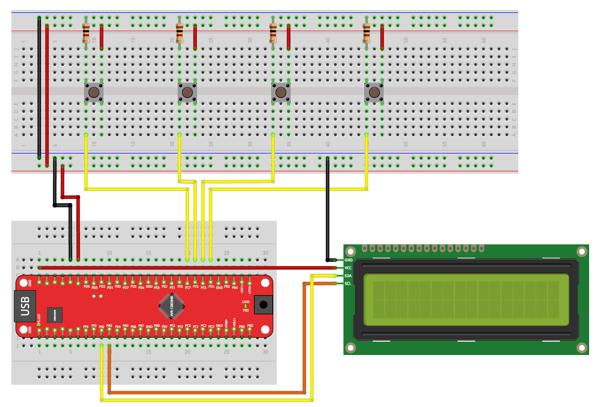

# Exercise 04: Button Integration

Introduction to GPIO input on the AVR128DB48.  
This exercise covers reading button states, debouncing, and building input-driven programs.

> This exercise uses the same hardware setup as Exercise 03, extended with 4 buttons.

---

## Hardware Setup

8 LEDs on Port D (PD0–PD7) and 4 buttons on Port C (PC4–PC7).  
Each button connects its pin to GND when pressed. The AVR internal pull-up resistor keeps the pin HIGH when the button is open.



| AVR128DB48 Pin | Component |
|----------------|-----------|
| PD0 – PD7 | LED 0–7 (anode) via series resistor |
| PC4 | Button 1 (to GND) |
| PC5 | Button 2 (to GND) |
| PC6 | Button 3 (to GND) |
| PC7 | Button 4 (to GND) |
| GND | Common ground rail |

---

## How to Use the Shared Files

The `../shared/` folder contains two files:

```
shared/
├── leds.h    - pin masks, constants, and function prototypes
└── leds.c    - reference implementation (solutions)
```

**Your workflow:**

1. Copy `leds.h` into your Microchip Studio project. It gives you all the `#define` constants and function prototypes you need.
2. Create your own `leds.c` alongside your `main.c` and implement the functions declared in `leds.h` yourself.
3. Include both files in your project. Your `main.c` only calls the functions - the implementation is yours to write.
4. Once you have solved a part, you can compare your implementation with the reference in `../shared/leds.c`.

> The goal is to write the function implementations yourself. Copying `leds.c` directly defeats the purpose of the exercise.

---

## Learning Goals

- Configure GPIO pins as input using `PORTC.DIRCLR`
- Enable internal pull-up resistors using `PINxCTRL`
- Read pin states using `PORTC.IN`
- Understand active-low button wiring
- Implement button debouncing using `_delay_ms()`
- Detect button press edges (new press vs held)

---

## Exercises

The exercise parts are described in [EXERCISES.md](https://github.com/gienyne/Some-Embedded-avr128db48-projekt/blob/master/exercices/03_led-control%20%26%2004_buttons/04-buttons/exercise/Readme.md).  
Work through them in order. Check `../shared/leds.c` only after solving each part yourself.

---

## Project Structure

```
04-buttons/
│
├── README.md
├── EXERCISES.md
├── images/
│   └── Versuchsaufbau3.png
│
├── starter/
│   ├── 4.1-light-by-button/main.c
│   ├── 4.2-debounced-counter/main.c
│   ├── 4.3-binary-calculator/main.c
│   └── 4.4-button-by-light/main.c
│
└── solutions/
    ├── 4.1-light-by-button/main.c
    ├── 4.2-debounced-counter/main.c
    ├── 4.3-binary-calculator/main.c
    └── 4.4-button-by-light/main.c

shared/                        (one level up — ../shared/)
├── leds.h                     - include this in your project
└── leds.c                     - reference implementation, check after solving
```

---

## Resources

- [AVR128DB48 Datasheet](https://ww1.microchip.com/downloads/en/DeviceDoc/AVR128DB28-32-48-64-DataSheet-DS40002247A.pdf)
- [Microchip Studio Setup Guide](../../docs/microchip-studio-setup.md)
