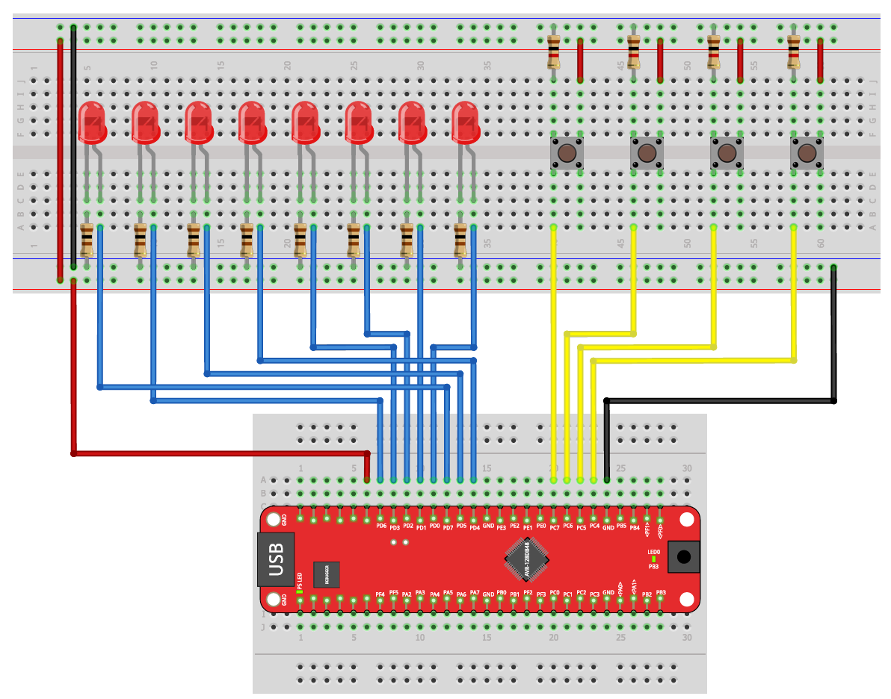
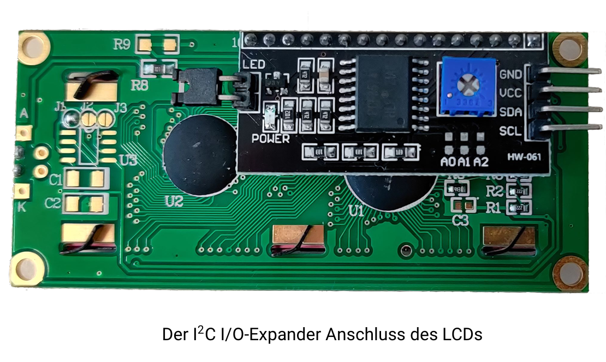

# Exercise 05: Liquid Crystal Display (LCD)

Introduction to I2C communication and character display on the AVR128DB48.  
This exercise uses a HD44780 1602 LCD connected via an HW-061 I2C interface module.

> New to Microchip Studio? See the [setup guide](../../docs/microchip-studio-setup.md) first.

---

## Hardware Setup

The LCD module communicates with the AVR128DB48 over the I2C bus using only two data lines.





| AVR128DB48 Pin | LCD Module Pin | Description |
|----------------|----------------|-------------|
| PA2 | SDA | Serial Data |
| PA3 | SCL | Serial Clock |
| 5V | VCC | Power supply |
| GND | GND | Ground |

The I2C address of the LCD module is `0x27` (default when pins A1, A2, A3 of the HW-061 are open).

Part 5.4 also uses the 8 LEDs and 4 buttons from Exercises 03 and 04 (Port D and Port C).

---

## Library Files

This exercise uses two libraries provided as part of the course.  
They are located in the `lib/` folder and must be included in your Microchip Studio project.

```
├── lib/
├── AVR128DB48_I2C/
│   ├── AVR128DB48_I2C.h   - I2C master driver header
│   ├── AVR128DB48_I2C.c   - I2C master driver implementation
├── I2C_LCD/
│   ├── I2C_LCD.h          - LCD control library header
│   └── I2C_LCD.c          - LCD control library implementation

```

**Authors:** David Lotz — Mikroprozessortechnik, Technische Hochschule Mittelhessen  
These files are provided as-is. Do not modify them.

### How to add the libraries to your project

In Microchip Studio, navigate to:

```
Solution Explorer -> right-click your project -> Add -> Existing Item
```

Select both `.c` files and both `.h` files from the `lib/` folder.  
Then include the headers in your `main.c`:

```c
#include "AVR128DB48_I2C.h"
#include "I2C_LCD.h"
```

Always call `lcd_init()` once at the start of `main()` before using any other LCD function.

---

## Available LCD Functions

| Function | Description |
|----------|-------------|
| `lcd_init()` | Initializes the display. Must be called first. |
| `lcd_clear()` | Clears all characters on the display. |
| `lcd_moveCursor(x, y)` | Moves cursor to column `x` (0–15), row `y` (0–1). |
| `lcd_putChar(c)` | Writes a single character at the current cursor position. |
| `lcd_putString(s)` | Writes a null-terminated string at the current cursor position. |
| `lcd_backlight(bool)` | Enables or disables the backlight. |
| `lcd_enable(bool)` | Shows or hides all characters. |
| `lcd_leftToRight()` | Cursor advances left to right after each write (default). |
| `lcd_rightToLeft()` | Cursor advances right to left after each write. |

---

## Learning Goals

- Initialize and use an I2C peripheral on the AVR128DB48
- Write characters and strings to an LCD display
- Position the cursor using `lcd_moveCursor(x, y)`
- Convert integers to strings for display
- Combine LCD output with GPIO input (buttons) and output (LEDs)

---

## Exercises

The exercise parts are described in [EXERCISES.md](./EXERCISES.md).  
Work through them in order. Solutions are in the `solutions/` folder. Open them only after solving each part yourself.

---

## Project Structure

```
05-lcd/
│
├── README.md
├── exercise/
│   └── EXERCISES.md
├── images/
│   └── versuchsaufbau-lcd.png
│
├── lib/
├── AVR128DB48_I2C/
│   ├── AVR128DB48_I2C.h
│   ├── AVR128DB48_I2C.c
├── I2C_LCD/
│   ├── I2C_LCD.h
│   └── I2C_LCD.c
│
├── starter/
│   ├── 5.1-hello-display/main.c
│   ├── 5.2-count-up/main.c
│   ├── 5.3-ping-pong/main.c
│   └── 5.4-binary-calculator/main.c
│
└── solutions/
    ├── 5.1-hello-display/main.c
    ├── 5.2-count-up/main.c
    ├── 5.3-ping-pong/main.c
    └── 5.4-binary-calculator/main.c
```

---

## Resources

- [AVR128DB48 Datasheet](https://ww1.microchip.com/downloads/en/DeviceDoc/AVR128DB28-32-48-64-DataSheet-DS40002247A.pdf)
- [HD44780 LCD Datasheet](https://www.sparkfun.com/datasheets/LCD/HD44780.pdf)
- [PCF8574 I/O Expander Datasheet](https://www.ti.com/lit/ds/symlink/pcf8574.pdf)
- [Microchip Studio Setup Guide](../../docs/microchip-studio-setup.md)