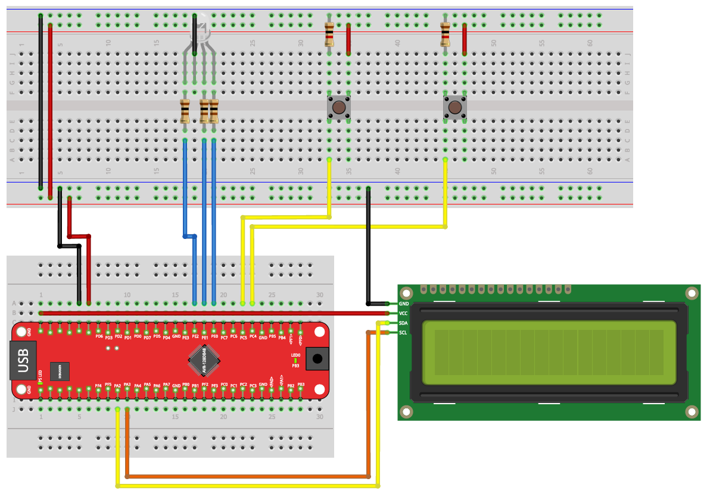

# Exercise 06: Interrupts and Timers

Introduction to hardware interrupts and timer peripherals on the AVR128DB48.  
This exercise uses the internal interrupt system (`avr/interrupt.h`) and the TCA0 timer  
to build time-driven and event-driven programs.

> New to Microchip Studio? See the [setup guide](../../docs/microchip-studio-setup.md) first.

---

## Hardware Setup

LCD display, two push buttons, and one RGB LED.  
Compared to Exercise 05, two buttons are removed and an RGB LED is added on Port E.



| AVR128DB48 Pin | Component | Description |
|----------------|-----------|-------------|
| PE0 | RGB LED -> Red channel | via series resistor |
| PE1 | RGB LED -> Green channel | via series resistor |
| PE2 | RGB LED -> Blue channel | via series resistor |
| PC4 | Button 1 | to GND, interrupt on rising edge |
| PC5 | Button 2 | to GND, interrupt on rising edge |
| PA2 | LCD SDA | I2C data line |
| PA3 | LCD SCL | I2C clock line |
| GND | Common ground | |

> **Note on color mapping:** the RGB LED used here has no native yellow output.  
> In Part 6.3 (Traffic Light), blue (PE2) is used in place of yellow.  
> The logical state machine remains correct. Only the displayed color differs from a real traffic light.

---

## Library Files

Parts 6.2 and 6.4 use the LCD and I2C libraries from Exercise 05.  
Include `avr/interrupt.h` in all parts of this exercise.

```c
#include <avr/interrupt.h>   /* required for ISR() and sei() */
```

For parts using the LCD:

```c
#include "../../05-lcd/lib/AVR128DB48_I2C.h"
#include "../../05-lcd/lib/I2C_LCD.h"
```

---

## Learning Goals

- Write Interrupt Service Routines (ISRs) for GPIO and timer events
- Configure the TCA0 timer peripheral in Normal mode
- Use `volatile` correctly for shared variables
- Clear interrupt flags manually inside ISRs
- Combine timer and GPIO interrupts in the same program
- Implement a pseudo-random number generator (Xorshift32)

---

## Concepts Used in This Exercise

<details>
<summary>Interrupt Service Routines (ISR)</summary>

An ISR is a function the CPU executes automatically when a hardware event occurs.  
The main loop is paused, the ISR runs, then execution resumes where it left off.

```c
ISR(PORTC_PORT_vect) {   /* fires when any PORTC pin interrupt triggers */
    /* handle event */
}

ISR(TCA0_OVF_vect) {     /* fires when TCA0 timer overflows             */
    /* handle event */
}
```

Rules:
- Keep ISRs short. Do as little work as possible inside them
- Always clear the interrupt flag at the end, or the ISR fires again immediately
- Call `sei()` after all configuration is done to enable global interrupts

</details>

<details>
<summary>Interrupt Flags</summary>

When a hardware event occurs, the AVR sets a flag bit to signal it.  
The flag is **never cleared automatically**. You must clear it at the end of your ISR:

```c
/* inside ISR(PORTC_PORT_vect) */
PORTC.INTFLAGS = PIN4_bm;

/* inside ISR(TCA0_OVF_vect) */
TCA0.SINGLE.INTFLAGS = TCA_SINGLE_OVF_bm;
```

Writing `1` to a flag bit clears it. This is standard AVR behaviour.  
If you forget to clear the flag, the ISR will fire again immediately after returning.

</details>

<details>
<summary>volatile</summary>

Variables shared between an ISR and the main loop must be declared `volatile`:

```c
volatile uint8_t led_state = 0;
```

Without `volatile`, the compiler may cache the value in a CPU register and never  
re-read it from memory.The main loop would never see updates made by the ISR.  
`volatile` forces the compiler to always read from memory.

</details>

<details>
<summary>Timer Overflow and Prescaler</summary>

A hardware timer counts upward from 0. When it reaches `PER`, it wraps to 0 : an **overflow**.

```
overflow rate = F_CPU / prescaler / (PER + 1)
```

For 1 Hz at F_CPU = 4 MHz, prescaler 64:

```
4,000,000 / 64 / 62,500 = 1 Hz
```

```c
TCA0.SINGLE.PER     = 62500;
TCA0.SINGLE.INTCTRL = TCA_SINGLE_OVF_bm;
TCA0.SINGLE.CTRLA   = TCA_SINGLE_ENABLE_bm
                    | TCA_SINGLE_CLKSEL0_bm
                    | TCA_SINGLE_CLKSEL2_bm;   /* prescaler 64 */
```

The prescaler divides the CPU clock before it reaches the timer. 
Prescaler 64 means the timer counts at 4,000,000 / 64 = 62,500 ticks per second.

</details>

<details>
<summary>GPIO Interrupt Configuration</summary>

To trigger an ISR on a pin event, configure the interrupt sense on that pin:

```c
PORTC.PIN4CTRL = PORT_PULLUPEN_bm | PORT_ISC_RISING_gc;
```

- `PORT_ISC_RISING_gc`    -> trigger on rising edge  (LOW -> HIGH)
- `PORT_ISC_FALLING_gc`   -> trigger on falling edge (HIGH -> LOW)
- `PORT_ISC_BOTHEDGES_gc` -> trigger on both edges

With active-low buttons and pull-ups enabled, the pin goes LOW when pressed and HIGH when released.  
`RISING_gc` triggers on release. Use `FALLING_gc` for press detection.

</details>

<details>
<summary>Pull-up and Pull-down Resistors</summary>

Digital input pins must never be left floating.
A floating input has no defined voltage level and may randomly switch between HIGH and LOW due to electrical noise.

A resistor is therefore used to force the pin into a known default state when the button is not pressed.

### Pull-up resistor

A pull-up resistor connects the input pin to VCC.

* button released -> input reads HIGH
* button pressed  -> input connected to GND -> reads LOW

On AVR microcontrollers, an internal pull-up resistor can be enabled in software:

```c
PORTC.PIN4CTRL = PORT_PULLUPEN_bm | PORT_ISC_RISING_gc;
```

### Pull-down resistor

A pull-down resistor connects the input pin to GND.

* button released -> input reads LOW
* button pressed  -> input connected to VCC -> reads HIGH

Unlike pull-ups, AVR128DB48 devices do not provide configurable internal pull-down resistors.
Pull-down resistors are therefore typically implemented externally in hardware.

### External vs. internal resistors

If the hardware circuit already contains a pull-up or pull-down resistor, enabling another resistor in software is usually unnecessary.

Using multiple resistors does not normally damage the circuit.
The resistors simply act in parallel, reducing the total equivalent resistance.

For this reason:

* internal pull-ups are useful when no external resistor is present,
* external resistors are preferred when the hardware already defines the input state clearly.


### Practical Application for This Exercise

In this exercise, the button is wired with an **external pull-down resistor**.
* Consequently, the logic is **Active-High** (pressing the button sends 5V / HIGH).
* To detect a button **press**, we configure the interrupt on a rising edge (`LOW -> HIGH`) without enabling the internal pull-up:

```c
PORTC.PIN4CTRL = PORT_ISC_RISING_gc; // Triggers on button press (Rising edge)
```
</details>


---

## Exercises

The exercise parts are described in [EXERCISES.md](https://github.com/gienyne/Some-Embedded-avr128db48-projekt/blob/master/exercices/06-interrupts-timers/exercise/README.md).  
Work through them in order. Solutions are in the `solutions/` folder. Open them only after solving each part yourself.

---

## Project Structure

06-interrupts-timers/
│
├── README.md
├── EXERCISES.md
├── images/
│   └── versuchsaufbau4.png
│
├── starter/
│   ├── 6.1-button-interrupt/main.c
│   ├── 6.2-timer/main.c
│   ├── 6.3-traffic-light/main.c
│   └── 6.4-programmable-timer/main.c
│
└── solutions/
    ├── 6.1-button-interrupt/main.c
    ├── 6.2-timer/main.c
    ├── 6.3-traffic-light/main.c
    └── 6.4-programmable-timer/main.c

---

## Resources

- [AVR128DB48 Datasheet](https://ww1.microchip.com/downloads/en/DeviceDoc/AVR128DB28-32-48-64-DataSheet-DS40002247A.pdf)
- [Microchip Studio Setup Guide](../../docs/microchip-studio-setup.md)
