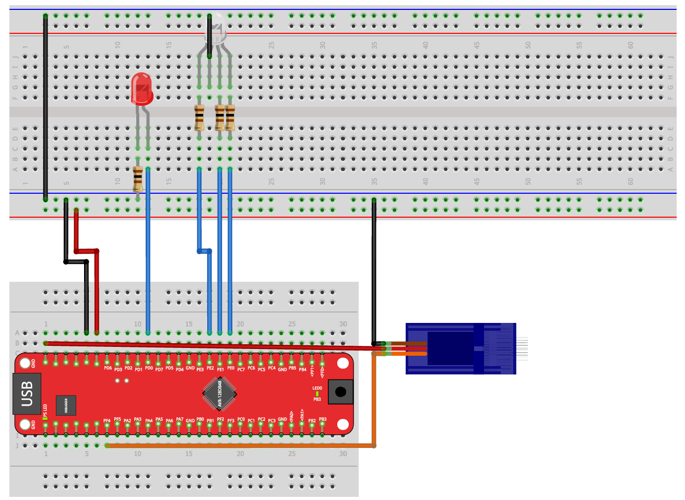

# Exercise 07: Pulse Width Modulation (PWM)

Introduction to hardware PWM on the AVR128DB48.  
This exercise uses the TCA0 timer in Single Slope PWM mode to control LED brightness  
and servo motor position without CPU involvement.

> New to Microchip Studio? See the [setup guide](https://github.com/gienyne/Some-Embedded-avr128db48-projekt/blob/master/docs/microchip-studio-setup.md) first.

---

## Hardware Setup

One red LED, one RGB LED, and one servo motor.



| AVR128DB48 Pin | Component | Description |
|----------------|-----------|-------------|
| PD0 | Red LED (anode) | via series resistor |
| PE0 | RGB LED -> Red channel | via series resistor |
| PE1 | RGB LED -> Green channel | via series resistor |
| PE2 | RGB LED -> Blue channel | via series resistor |
| PF4 | Servo -> Signal (orange) | PWM control signal |
| 5V | Servo -> Power (red) | supply voltage |
| GND | Servo -> Ground (brown) | common ground |

---

## Concepts Used in This Exercise

<details>
<summary>How PWM Works</summary>

PWM (Pulse Width Modulation) is a technique for simulating an analog output using a digital pin.  
The pin switches rapidly between HIGH and LOW. By varying how long it stays HIGH within each cycle,  
the average voltage seen by the component changes.

The timer counts from 0 to `PER`, then restarts. The compare register `CMP` defines  
the moment when the output switches from HIGH to LOW:

```
counter < CMP   ->  pin HIGH
counter >= CMP  ->  pin LOW
```

Example with PER = 100, CMP = 25:

```
|--- ON ---|------------- OFF ------------|
0         25                            100
```

This is 25% duty cycle -> LED at 25% brightness.

The switching happens so fast (thousands of times per second) that the human eye  
perceives only the average brightness, not the individual pulses.

</details>

<details>
<summary>TCA0 in Single Slope PWM Mode</summary>

Single Slope PWM is the simplest PWM mode: the timer counts up from 0 to PER, then resets.

```c
TCA0.SINGLE.PER   = 100;                          /* cycle length              */
TCA0.SINGLE.CMP0  = 25;                           /* duty cycle for channel 0  */

TCA0.SINGLE.CTRLB = TCA_SINGLE_CMP0EN_bm          /* enable channel 0 output   */
                  | TCA_SINGLE_WGMODE_SINGLESLOPE_gc;

TCA0.SINGLE.CTRLA = TCA_SINGLE_CLKSEL_DIV4_gc     /* prescaler = 4             */
                  | TCA_SINGLE_ENABLE_bm;          /* start timer               */
```

Three compare channels are available: CMP0, CMP1, CMP2, one per RGB color channel.

</details>

<details>
<summary>PORTMUX: Routing PWM to Physical Pins</summary>

The timer generates the PWM signal internally, but it must be explicitly routed  
to the physical output pins using the PORTMUX peripheral:

```c
PORTMUX.TCAROUTEA = PORTMUX_TCA0_PORTD_gc;   /* route TCA0 output to Port D */
PORTMUX.TCAROUTEA = PORTMUX_TCA0_PORTE_gc;   /* route TCA0 output to Port E */
PORTMUX.TCAROUTEA = PORTMUX_TCA0_PORTF_gc;   /* route TCA0 output to Port F */
```

Without PORTMUX configuration, the PWM signal exists inside the microcontroller  
but never reaches the LED or servo pin.

The TCA0 compare channels map to pins as follows (after routing):

| Channel | Port D | Port E | Port F |
|---------|--------|--------|--------|
| CMP0    | PD0    | PE0    | PF0    |
| CMP1    | PD1    | PE1    | PF1    |
| CMP2    | PD2    | PE2    | PF2    |

</details>

<details>
<summary>LED PWM vs Servo PWM : Key Difference</summary>

LED brightness and servo position both use PWM, but with different requirements:

**LED:** the duty cycle controls brightness. The frequency can be anything fast enough  
that the eye cannot detect the flicker (typically above 50 Hz).

**Servo:** the servo does not care about duty cycle as a percentage.  
It measures the **absolute duration** of the HIGH pulse within a fixed 20 ms period (50 Hz).

| Pulse width | Servo position |
|-------------|----------------|
| 1.0 ms HIGH | Full left      |
| 1.5 ms HIGH | Center         |
| 2.0 ms HIGH | Full right     |

The period must be exactly 20 ms. Only the pulse width changes.

</details>

<details>
<summary>Servo Timer Calculation</summary>

To produce a 20 ms period with F_CPU = 4 MHz:

Choose prescaler DIV8:

```
timer tick rate = 4,000,000 / 8 = 500,000 ticks/second
ticks per 20 ms = 500,000 × 0.020 = 10,000
```

So `PER = 10000`.

Pulse width values:

```
1.0 ms → 500,000 × 0.001 = 500   ticks  (full left)
1.5 ms → 500,000 × 0.0015 = 750  ticks  (center)
2.0 ms → 500,000 × 0.002 = 1000  ticks  (full right)
```

</details>

---

## Learning Goals

- Configure TCA0 in Single Slope PWM mode
- Use PORTMUX to route PWM signals to physical pins
- Control LED brightness by varying the compare register value
- Understand the difference between LED PWM and servo PWM
- Generate a precise 20 ms servo control signal
- Implement smooth continuous servo movement using incremental position updates

---

## Exercises

The exercise parts are described in [EXERCISES.md](./EXERCISES.md).  
Work through them in order. Solutions are in the `solutions/` folder. Open them only after solving each part yourself.

---

## Project Structure

```
07-pwm/
│
├── README.md
├── EXERCISES.md
├── images/
│   └── versuchsaufbau5.png
│
├── starter/
│   ├── 7.1-dimming-red-led/main.c
│   ├── 7.2-gradient-rainbow-led/main.c
│   └── 7.3-waving-servomotor/main.c
│
└── solutions/
    ├── 7.1-dimming-red-led/main.c
    ├── 7.2-gradient-rainbow-led/main.c
    └── 7.3-waving-servomotor/main.c
```

---

## Resources

- [AVR128DB48 Datasheet](https://ww1.microchip.com/downloads/en/DeviceDoc/AVR128DB28-32-48-64-DataSheet-DS40002247A.pdf)
- [Microchip Studio Setup Guide](https://github.com/gienyne/Some-Embedded-avr128db48-projekt/blob/master/docs/microchip-studio-setup.md)
