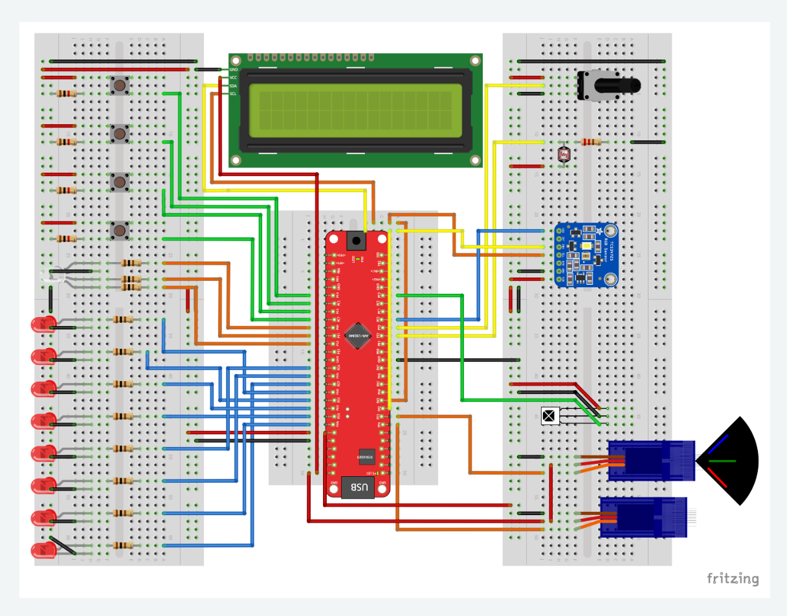
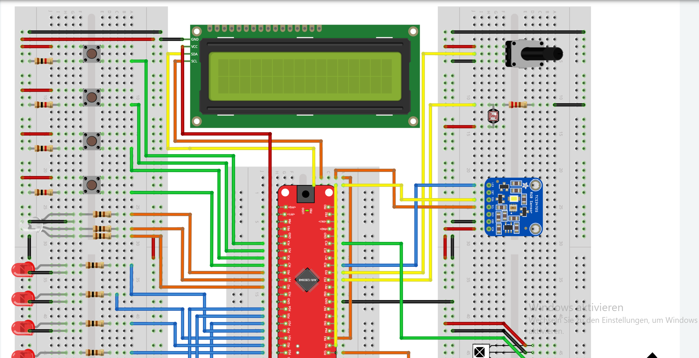

# Exercise 09: I²C

Introduction to the I²C communication protocol on the AVR128DB48.

In this exercise you will:

- configure an external I²C device,
- access sensor registers,
- perform Write and Read transactions,
- reconstruct 16-bit measurement values,
- display sensor data on an LCD,
- analyze real I²C traffic using a Logic Analyzer.

The TCS34725 color sensor is used as an example device throughout the exercise.

> New to Microchip Studio? See the [setup guide](../../docs/microchip-studio-setup.md) first.

---

## Hardware Setup

The schematic below shows the full lab setup used across multiple exercises.  
For this exercise, identify which components and connections are relevant:  
the TCS34725 color sensor (blue board, top right) communicates with the AVR128DB48  
over I²C (SDA / SCL), shared with the LCD module.
> Both the LCD and the TCS34725 share the same I²C bus.
> The devices are distinguished by their I²C addresses.





> **Task before coding:** look at both schematics and identify which wires, resistors,  
> and components you need for this exercise. Not everything visible is used here.

| AVR128DB48 Pin | Component | Description |
|----------------|-----------|-------------|
| PA2 (SDA) | TCS34725 SDA + LCD SDA | I²C data - shared bus |
| PA3 (SCL) | TCS34725 SCL + LCD SCL | I²C clock - shared bus |
| 3.3V / VCC | TCS34725 VIN | sensor power supply |
| GND | TCS34725 GND | common ground |
| PA2 (SDA) | LCD SDA | same I²C bus |
| PA3 (SCL) | LCD SCL | same I²C bus |

**I²C addresses used in this exercise:**

| Device | Address |
|--------|---------|
| LCD (PCF8574 I/O expander) | `0x27` |
| TCS34725 color sensor | `0x29` |

---

## Library Files

This exercise uses the same I²C and LCD libraries as Exercise 05.

```c
#include "../../05-lcd/lib/AVR128DB48_I2C.h"
#include "../../05-lcd/lib/I2C_LCD.h"
```

Both devices share the same I²C bus — the library handles addressing so they  
do not interfere with each other.

---

## Concepts Used in This Exercise

<details>
<summary>I²C Protocol: How a Transaction Works</summary>

A complete I²C transaction follows this sequence:

```
START
-> 7-bit device address + R/W bit
-> ACK from device
-> data bytes (8 bits per byte)
-> ACK after each byte
-> STOP (or REPEATED START for combined operations)
```

The R/W bit determines the direction:
- `0` = Write (master sends data to device)
- `1` = Read  (device sends data to master)

The ACK is sent by pulling SDA LOW during the **9th clock cycle** after each byte.  
A NACK (SDA HIGH) signals the end of a read transaction.

A **STOP condition** occurs when SDA transitions from LOW to HIGH while SCL is HIGH.

</details>

<details>
<summary>Three Types of Addresses: Don't Confuse Them</summary>

A common beginner mistake is confusing these three completely different kinds of addresses.

When working with I²C sensors, three different kinds of "addresses" appear in the code.  
They look similar but have completely different roles:

**1. I²C device address**: who to contact on the bus:
```c
#define TCS34725_ADDRESS 0x29
```

**2. Internal register address**: which register inside the device to access:
```c
#define ENABLE_REGISTER 0x00
#define ATIME_REGISTER  0x01
```

**3. RAM memory address**: where the variable lives in the microcontroller's RAM:
```c
uint8_t start_addr = 0x94;
i2c_write(TCS34725_ADDRESS, &start_addr, 1);
// &start_addr is the RAM address of the variable, not its value
```

The device never sees the RAM address. The `i2c_write` function needs it  
to know where to read the bytes from before sending them on the bus.

</details>

<details>
<summary>CMD_BIT: Why 0x80 is Prepended to Every Register Address</summary>

The TCS34725 requires that the most significant bit (bit 7) of the first byte  
in every transaction is set to 1. This is the **Command bit**:

```
bit 7   bits 6..0
  1       ADDR
```

Without it, the sensor ignores the command.

This requirement comes directly from the TCS34725 datasheet's Command Register definition.

```c
#define CMD_BIT 0x80

// To access register 0x00 (ENABLE):
CMD_BIT | 0x00 = 0x80

// To access register 0x14 (CDATAL):
CMD_BIT | 0x14 = 0x94
```

This is why every register access in this exercise prepends `CMD_BIT`.

</details>

<details>
<summary>Write-Then-Read: How to Select a Starting Register</summary>

To read data from a specific register, the master first performs a **Write** to  
tell the sensor which register to start reading from, then performs a **Read**:

```
Typical transaction sequence:

START
-> Write [0x29]
-> 0x94
-> ACK
-> STOP

START
-> Read [0x29]
-> data[0..7]
-> NACK
-> STOP
```
> Note:
> Many I²C devices perform this operation using a Repeated START instead of a STOP.
> The provided library performs two separate transactions, which is fully compatible with the TCS34725.

`0x94 = CMD_BIT | 0x14` selects register `0x14` (CDATAL) as the starting point.  

Note that `0x94` is not an I²C device address.

It is a command byte consisting of:

```text
0x80  -> CMD_BIT
0x14  -> CDATAL register address
------
0x94
```

The actual I²C device address remains `0x29`.
The sensor then auto-increments through registers 0x14–0x1B, returning 8 bytes.

An example of this transaction captured with a Logic Analyzer can be found in

[docs/logic-analyzer-i2c.md](https://github.com/gienyne/Some-Embedded-avr128db48-projekt/blob/master/docs/logic-analyzer-i2c.pdf).

The document contains a step-by-step analysis of real I²C frames exchanged between the AVR128DB48, the LCD module and the TCS34725 sensor.

</details>

<details>
<summary>Low Byte / High Byte - Reconstructing 16-bit Values</summary>

The TCS34725 returns each color channel as two separate 8-bit bytes (low and high).

He stores multi-byte values in little-endian format:

```text
Low Byte first
High Byte second

They must be combined into a single 16-bit value:

```c
uint16_t value = (uint16_t)(low | (high << 8));
```

Example: `low = 0xF4`, `high = 0x01`

```
high << 8:   0x01 -> 0x0100
low:                 0x00F4
OR:                  0x01F4  =  500
```

The cast to `uint16_t` ensures the bit shift operates on the correct type  
and the result is stored correctly.

</details>

<details>
<summary>ATIME: Integration Time Calculation</summary>

The ATIME register controls how long the sensor integrates light before producing a reading.  
The formula from the TCS34725 datasheet:

```
integration time = (256 - ATIME) × 2.4 ms
```

For `ATIME = 0xD5` (= 213 decimal):

```
(256 - 213) × 2.4 ms = 43 × 2.4 ms = 103.2 ms
```
The example configuration therefore uses:

```c
ATIME = 0xD5;
```

which corresponds to approximately 103 ms.

> Note:
> The TCS34725 datasheet uses `ATIME = 0xD6` as an example value for a
> nominal integration time of approximately 100 ms (100.8 ms).
>
> This exercise uses `ATIME = 0xD5` instead, resulting in an integration
> time of approximately 103.2 ms. The difference is only one integration
> step (2.4 ms) and has no significant impact on the measurements.

> Note:
> If you use `ATIME = 0xD6` instead of `0xD5`, your I²C communication
> sequence remains identical. Only the value written to the ATIME register
> changes, so Logic Analyzer captures may differ by one configuration byte.

Longer integration time -> more light collected -> higher sensitivity in low light.  
Shorter integration time -> faster updates -> better for bright environments.

</details>

---

## Learning Goals

## Learning Goals

- Understand the complete I²C transaction structure:
  START, Address, R/W Bit, ACK/NACK and STOP
- Configure and communicate with an external I²C sensor (TCS34725)
- Write sensor register configuration sequences
- Perform a combined Write-then-Read transaction
- Reconstruct 16-bit values from two 8-bit register reads
- Display multi-channel sensor data on the LCD
- Interpret Logic Analyzer captures of I²C traffic

---

## Exercises

The exercise descriptions can be found in
[EXERCISES.md](https://github.com/gienyne/Some-Embedded-avr128db48-projekt/blob/master/exercices/09-i2c/exercise/README.md).

Work through the parts in order.

Part 9.1 focuses on communicating with the TCS34725 color sensor.

Part 9.2 focuses on analyzing the resulting I²C traffic using a Logic Analyzer.

A reference solution for Part 9.1 is available in the `solutions/` folder.

A complete worked example of a Logic Analyzer analysis is available in
[docs/logic-analyzer-i2c.md](https://github.com/gienyne/Some-Embedded-avr128db48-projekt/blob/master/docs/logic-analyzer-i2c.pdf).

> Try to solve and analyze the exercise yourself before consulting the provided solutions.

---

## Project Structure

```
09-i2c/
│
├── README.md
├── EXERCISES.md
├── images/
│   ├── versuchsaufbau-global.png
│   └── versuchsaufbau-detail.png
│
├── docs/
│   └── logic-analyzer-i2c.md
│
├── starter/
│   ├── 9.1-color-sensor/main.c
│   ├── 9.2-I²C Traffic Analysis with a Logic Analyzer
│
└── solutions/
    └── 9.1-color-sensor/main.c
    └── 9.2-./docs/logic-analyzer-i2c.md
```

---

## Resources

- [TCS34725 Datasheet](https://cdn-shop.adafruit.com/datasheets/TCS34725.pdf)
- [AVR128DB48 Datasheet](https://ww1.microchip.com/downloads/en/DeviceDoc/AVR128DB28-32-48-64-DataSheet-DS40002247A.pdf)
- [I²C Protocol Reference](https://learn.sparkfun.com/tutorials/i2c/all)
- [Microchip Studio Setup Guide](../../docs/microchip-studio-setup.md)
