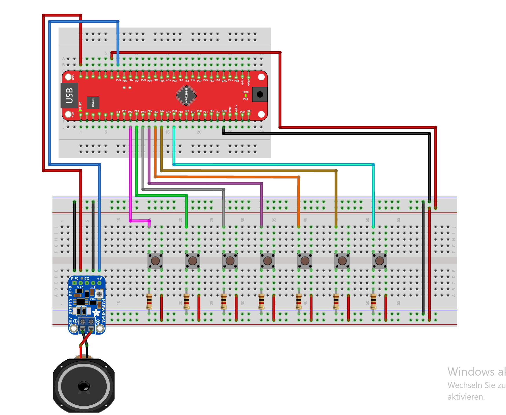
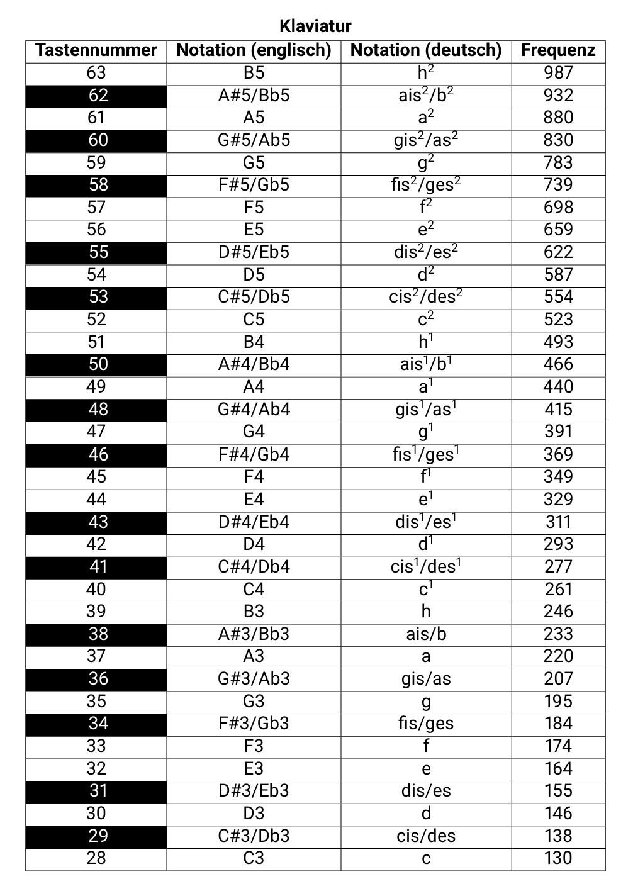

# Exercise 10: Digital/Analog Conversion (DAC) *(Bonus)*

Introduction to the DAC peripheral on the AVR128DB48.  
This exercise uses the DAC to generate audio signals through a passive speaker  
connected via a PAM8302A amplifier.

> New to Microchip Studio? See the [setup guide](../../docs/microchip-studio-setup.md) first.

---

## Hardware Setup

7 buttons as a keyboard, one passive speaker driven by a PAM8302A amplifier.




| AVR128DB48 Pin | Component | Description |
|----------------|-----------|-------------|
| PD6 (DAC output) | PAM8302A input (Vin) | analog audio signal |
| PA2 | Button - note C | keyboard key |
| PA3 | Button - note D | keyboard key |
| PA4 | Button - note E | keyboard key |
| PA5 | Button - note F | keyboard key |
| PA6 | Button - note G | keyboard key |
| PA7 | Button - note H | keyboard key |
| PB0 | Button - note A | keyboard key |
| 5V | PAM8302A Vin+ | amplifier power |
| GND | PAM8302A GND | common ground |

> **Important:** the amplifier's SD (shutdown) pin must be connected to GND  
> to keep it active. The maximum DAC output voltage is 2V. do not exceed this  
> to avoid damaging the speaker or amplifier.



---

## Library Files

This exercise uses `song.h` provided as part of the course.  
It is located in the `lib/` folder and must be included in your project.

```c
#include "song.h"
```

**Author:** David Lotz: Mikroprozessortechnik, Technische Hochschule Mittelhessen  
Do not modify this file.

### Contents of song.h

- `sine_table[]` -> 64-entry lookup table of a full sine wave period (10-bit values, 0–1023)
- `enum notes` -> all playable note frequencies (e.g. `c1 = 261`, `a1 = 440`, `mute = 1`)
- `song` struct -> contains `bpm`, `length`, `tone[]`, `tone_length[]`
- `mario` -> the Mario theme as a `song` instance
- `sweep_up_down_0`, `sweep_up_down_1` -> scale sweep songs for testing

---

## Concepts Used in This Exercise

<details>
<summary>DAC: Digital to Analog Conversion</summary>

The DAC converts a digital number into a proportional analog voltage on pin PD6.  
The AVR128DB48 DAC has 10-bit resolution, producing values from 0 to 1023.

With a 2.048V reference:
- `DATA = 0`    -> 0V output
- `DATA = 512`  -> ~1.024V output
- `DATA = 1023` -> ~2.048V output

Configuration:

```c
VREF.DAC0REF = VREF_REFSEL_2V048_gc;   /* 2.048V reference */
DAC0.CTRLA   = DAC_ENABLE_bm
             | DAC_OUTEN_bm;            /* enable output on PD6 */
```

Writing a value:

```c
DAC0.DATA = value;   /* 10-bit value, 0–1023 */
```

> **Register alignment:** the `DATA` register is 16-bit but only bits 15:6 are used  
> (the 10 data bits). This means the value must be left-shifted by 6 before writing  
> if your `sine_table` values are in the range 0–1023:
>
> ```c
> DAC0.DATA = sine_table[i] << 6;
> ```
>
> Some configurations write directly without shifting — check the datasheet  
> section 33 for your specific setup.

</details>

<details>
<summary>Sine Wave Generation: How Audio is Produced</summary>

A pure tone is a sine wave. The DAC cannot produce a continuous sine - instead,  
it outputs discrete steps from a precomputed lookup table (`sine_table`).

The `sine_table` contains 64 values representing one full period of a sine wave.  
A timer interrupt advances through the table at a rate that determines the output frequency:

```
frequency = F_CPU / (prescaler * (PER + 1) * SINE_SIZE)
```

Rearranged to find `PER`:

```
PER = (F_CPU / (frequency * SINE_SIZE)) - 1
```

Example for A4 (440 Hz) with no prescaler and SINE_SIZE = 64:

```
PER = (4,000,000 / (440 * 64)) - 1 = 141 - 1 = 140
```

Each timer overflow advances one step in the sine table and writes the next sample  
to `DAC0.DATA`. The DAC outputs each value until the next interrupt.

</details>

<details>
<summary>Decay: Simulating a Piano Envelope</summary>

A real piano note starts loud and fades gradually — this is called the **amplitude envelope**.  
The simplest model is a decay: the volume starts at maximum and decreases over time.

**Why not apply decay in the audio ISR ?**

The audio ISR fires ~28,000 times per second for A4 (440 Hz * 64 samples).  
Decrementing volume on every audio sample would reduce it to zero in ~36 ms.  
The note would disappear almost instantly.

**Solution: use a separate 1 ms timer (TCA1)**

TCA1 fires once per millisecond. Volume is decremented there at a controlled rate:

```c
/* in ISR(TCA1_OVF_vect) - fires every 1 ms */
decay_counter++;
if (decay_counter >= DECAY_TICK_MS) {
    decay_counter = 0;
    if (volume > MIN_VOLUME) volume -= DECAY_STEP;
}
```

**In the audio ISR**, the sample is scaled by the current volume before writing:

```c
/* in ISR(TCA0_OVF_vect) */
uint32_t sample = (sine_table[i] * volume) / MAX_VOLUME;
DAC0.DATA = (uint16_t)sample;
```

At the start of each new note, volume is reset to maximum:

```c
volume = MAX_VOLUME;   /* before set_frequency() */
```

This produces a gradual fade that sounds natural, like a piano key being struck.

</details>

<details>
<summary>Note Duration: bpm and tone_length</summary>

The `song` struct uses musical timing:

- `bpm` -> beats per minute (tempo of the song)
- `tone_length[i]` -> duration of note `i` in beats

Duration in milliseconds:

```c
duration_ms = (60000UL / bpm) * tone_length[i]
```

Example: `bpm = 330`, `tone_length = 2`

```
(60000 / 330) * 2 = 181 * 2 = 363 ms
```

A 1 ms timer (TCA1) counts elapsed time. When `elapsed_ms >= duration_ms`,  
a flag `note_finished` is set and the main loop advances to the next note.

</details>

---

## Learning Goals

- Configure the DAC peripheral with a voltage reference
- Generate audio frequencies using a sine wave lookup table
- Use a timer interrupt to advance through the sine table at the correct rate
- Implement button-triggered notes using GPIO interrupts
- Implement a musical decay envelope using a separate timer
- Parse and play a structured song from the `song` struct

---

## Exercises

The exercise parts are described in [EXERCISES.md](https://github.com/gienyne/Some-Embedded-avr128db48-projekt/blob/master/exercices/10-dac-/exercise/README.md).  
Work through them in order. Solutions are in the `solutions/` folder.

---

## Project Structure

```
10-dac/
│
├── README.md
├── EXERCISES.md
├── images/
│   └── versuchsaufbau8.png
│   └── klaviatur
├── lib/
│   └── song.h
│
├── starter/
│   ├── 10.1-dac-speaker/main.c
│   ├── 10.2-button-keyboard/main.c
│   └── 10.3-songs-on-speaker/main.c
│
└── solutions/
    ├── 10.1-dac-speaker/main.c
    ├── 10.2-button-keyboard/main.c
    └── 10.3-songs-on-speaker/main.c
```

---

## Resources

- [AVR128DB48 Datasheet - Section 34: DAC](https://github.com/gienyne/Some-Embedded-avr128db48-projekt/blob/master/docs/AVR%20Manual%20setz.pdf)
- [Microchip Studio Setup Guide](../../docs/microchip-studio-setup.md)
